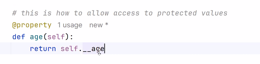
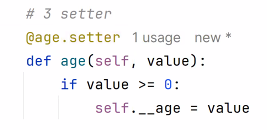

# python-OOP-Lec3-18-MAY-25
presentation 30
* to override function, need to explicate that you override the function.
  * for the meta data details (decorations)
  * need to import:
    ```
    from typing import override
    @override
        def __str__(self)->str:
    ```
* when creating new function in class, it automatically created with self.
  * even you when don't use it.
  * if a function doesn't contain the self option than the function is **static**!
* the files of classes, are names with snake case (mobile_phone.py)
* isinstance() is function that returns true/false if the object is type of given class:
  ```
  isinstance(object,MobilePhone)
  ```
  * is a function from reflection world: to investigate the class
  * bad practise function, because if you use it, you don't implement the OOP principle correctly.
  * getters & setters in class:
    * to protect access to attribute in the class, make it private in the init function:
    
      1) create attribute:
         ```
          self.__age# instead self.age
          ```
      2) create getter: to allow othersiders to see the attribute:
    
      
     
      3) if you want to allow to change it, create setter:
    
      
  
* extra:
  * library: pprint=pretty print